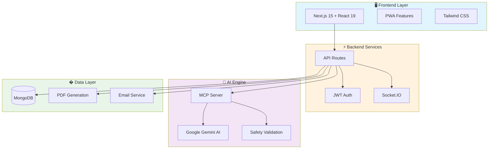
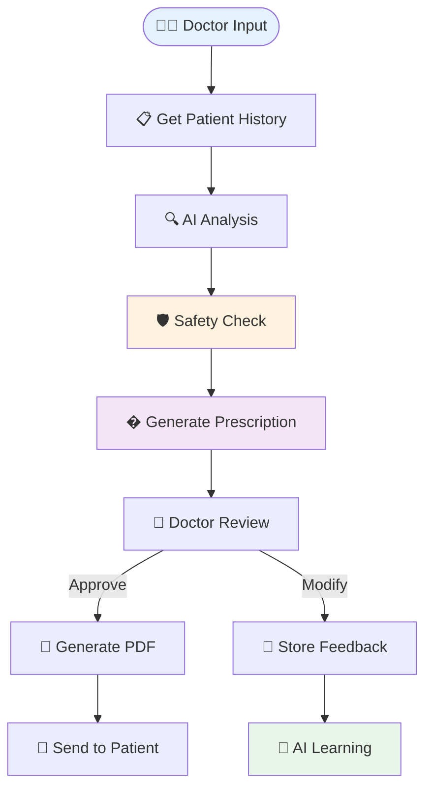

# 🏥 Doctor Care System

**AI-powered healthcare management platform** with **Next.js 15**, **MongoDB**, and **Google Gemini AI**. Features intelligent prescription generation, real-time patient management, and comprehensive medical analytics.

## 🌟 System Architecture



## 🚀 Quick Start

```bash
# Install dependencies
npm install

# Set up environment
cp .env.example .env.local
# Add your MongoDB URI, Gemini API key, and email service

# Run development server
npm run dev
```

**Prerequisites:** Node.js 18+, MongoDB, Google Gemini API key

## ✨ Features Overview

| Module | Description | Key Features |
|--------|-------------|--------------|
| 🤖 **AI Engine** | Gemini-powered medical intelligence | Smart prescriptions, safety validation, drug interactions |
| 👥 **Patients** | Comprehensive patient management | 360° profiles, medical history, risk assessment |
| 📅 **Appointments** | Intelligent scheduling system | Real-time booking, conflict detection, automated reminders |
| 💊 **Prescriptions** | Digital prescription workflows | AI generation, PDF creation, email delivery, tracking |
| � **Analytics** | Real-time insights dashboard | KPI tracking, health trends, treatment effectiveness |
| 💬 **AI Chat** | Context-aware medical assistant | Patient data access, intelligent responses, medical queries |

## 🤖 MCP AI Prescription Flow



## 📡 API Endpoints

### Core APIs
- `POST /api/auth/*` - Authentication & authorization
- `GET/POST /api/patients/*` - Patient management
- `GET/POST /api/appointments/*` - Appointment scheduling
- `GET/POST /api/prescriptions/*` - Prescription workflows
- `POST /api/ai-prescription/*` - AI-powered prescription generation

### Real-time Features
- `WebSocket /socketio-app` - Live notifications & updates
- `GET /api/dashboard-stats/*` - Real-time analytics
- `POST /api/chat/*` - AI chatbot with patient context

## �️ MCP Tools Reference

| Category | Tools | Purpose |
|----------|-------|---------|
| **Patient Data** | `get_patient_history`, `get_enhanced_patient_context` | Retrieve comprehensive patient information |
| **AI Prescription** | `create_prescription_with_gemini`, `update_prescription_feedback` | Generate and refine AI prescriptions |
| **Safety & Validation** | `validate_prescription_safety`, `check_drug_interactions` | Ensure medication safety |
| **Intelligence** | `get_doctor_preferences`, `get_patient_insights` | Personalized recommendations |
| **Search & Analytics** | `search_prescriptions`, `suggest_prescription_improvements` | Data analysis and optimization |

## 🎨 UI Components

Built with **Radix UI** + **Tailwind CSS** + **Framer Motion**

- 🌙 **Dark/Light Mode** - Automatic theme switching
- 📱 **Responsive Design** - Mobile-first approach
- ⚡ **Real-time Updates** - Live data synchronization
- 🎭 **Smooth Animations** - Enhanced user experience
- ♿ **Accessibility** - WCAG compliant components

## 🔒 Security Features

- 🔐 **JWT Authentication** with automatic refresh
- 🛡️ **bcrypt Password Hashing** for secure storage
- 🚫 **API Rate Limiting** prevents abuse
- ✅ **Input Validation** and sanitization
- 🏥 **HIPAA Compliance** for healthcare data
- � **Audit Trails** for all medical decisions

## 📊 Tech Stack

**Frontend:** Next.js 15 • React 19 • TypeScript • Tailwind CSS  
**Backend:** Node.js • MongoDB • Socket.IO • JWT  
**AI:** Google Gemini • MCP Server • OpenAI-compatible APIs  
**Tools:** Framer Motion • Radix UI • Recharts • jsPDF

## 📝 License

MIT License - see [LICENSE](LICENSE) file for details.

---

**🩺 Built for modern healthcare providers who want intelligent, efficient patient management.**

